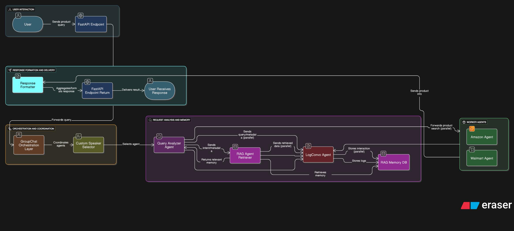

# 🧠 EAZZZ — Multi-Agent Conversational Product Finder

**EAZZZ** is an intelligent, agent-based conversational system designed to help users search, compare, and choose products using natural language queries. It leverages **LLMs**, **RAG**, **FastAPI**, and custom agents to create a seamless, chat-driven shopping experience that's fast, extendable, and built to scale.

---

## 🚀 Features

- 🚩 Natural Language Product Search
- 🤖 Multi-Agent Architecture with Role Separation
- 📚 RAG (Retrieval-Augmented Generation) Agent for Context-Aware Responses
- 🧠 Query Analysis & Response Formatting
- 📝 Conversation Logging via LogConvo Agent
- 👥 GroupChat Orchestration for Collaborative Responses
- 🧑‍💼 Custom Speaker Selector for Agent Specialization
- 🏃 FastAPI Backend
- 📂 Easily Extendable Agent System

---

## 🧭 System Workflow



---

## 🧠 Agent Descriptions

| Agent                    | Description |
|--------------------------|-------------|
| **Query Analyzer**       | Parses user queries and extracts intent and product attributes. |
| **RAG Agent**            | Searches and ranks real-world products using ChromaDB for local vector search. |
| **Response Formatter**   | Formats output into user-friendly JSON with clarity and consistency. |
| **LogConvo Agent**       | Logs queries and agent responses, storing context for future use. |
| **GroupChat Manager**    | Orchestrates collaboration between all agents and combines results. |
| **Custom Speaker Selector** | Dynamically routes tasks to specific agents ensuring modularity and control. |

---

## ⚙️ Getting Started

### 1. Clone the Repository

```bash
git clone https://github.com/jumon000/EAZZZ.git
cd EAZZZ
```

### 2. Install Dependencies

Ensure you have **Python 3.10+** installed, then install dependencies:

```bash
pip install -r requirements.txt
```

### 3. Environment Setup

Create a `.env` file in the root directory:

```env
OPENAI_API_KEY=your_openai_key
CHROMADB_PATH=./memory/chromadb
```

> 🔑 Replace `your_openai_key` with your actual OpenAI API key from [platform.openai.com](https://platform.openai.com)

### 4. Run the Server

Launch the FastAPI backend:

```bash
uvicorn api.main:app --reload
```

**Access Points:**
- 🌐 **API Root**: http://localhost:8000
- 📘 **Swagger UI**: http://localhost:8000/docs

---

## 🧪 Example Usage

### Sample Request

```bash
curl -X POST http://localhost:8000/query \
  -H "Content-Type: application/json" \
  -d '{"query": "Find me the best budget wireless headphones"}'
```

### Sample Response

```json
{
  "products": [
    {
      "title": "Sony WH-CH510",
      "price": "$38.99",
      "source": "Amazon",
      "url": "https://amazon.com/product-url"
    },
    {
      "title": "Onn Wireless Headphones",
      "price": "$24.88",
      "source": "Walmart",
      "url": "https://walmart.com/product-url"
    }
  ]
}
```

---

## 🚀 Roadmap

- 🔌 Integrate Additional APIs (Flipkart, eBay, etc.)
- 📈 Build Streamlit or React Frontend
- 🧠 Improve Memory with LlamaIndex or LangGraph
- 🔍 Add Richer Comparison and Filtering Logic
- 📊 Advanced Analytics and User Preferences

---

**Made with 💙, ☕ and 🧠 by [@jumon000](https://github.com/jumon000)**

